# CI-Action Usage Graph

This graph shows which repositories are using files from the ci-action repository.

## Incoming calls

Files in ci-action repository that are called by other repositories:

- [.github/workflows/ci.yml](https://github.com/untillpro/ci-action/blob/main/.github/workflows/ci.yml)
  - [airc-backoffice2: ci.yml](https://github.com/untillpro/airc-backoffice2/blob/main/.github/workflows/ci.yml#L12)
  - [airc-ticket-layouts: short_go.yml](https://github.com/untillpro/airc-ticket-layouts/blob/main/.github/workflows/short_go.yml#L7)
  - [airs-bp3: ci.yml](https://github.com/untillpro/airs-bp3/blob/main/.github/workflows/ci.yml#L18)
  - [airs-bp3: nightly_tests.yml](https://github.com/untillpro/airs-bp3/blob/main/.github/workflows/nightly_tests.yml#L9)
  - [dynobuffers: go.yml](https://github.com/untillpro/dynobuffers/blob/main/.github/workflows/go.yml#L5)
  - [web-portals: ci.yml](https://github.com/untillpro/web-portals/blob/main/.github/workflows/ci.yml#L12)
  - [web-portals: ci_payment.yml](https://github.com/untillpro/web-portals/blob/main/.github/workflows/ci_payment.yml#L20)
  - [web-portals: ci_reseller.yml](https://github.com/untillpro/web-portals/blob/main/.github/workflows/ci_reseller.yml#L19)
  - [voedger: ci-full.yml](https://github.com/voedger/voedger/blob/main/.github/workflows/ci-full.yml#L11)
  - [voedger: ci.yml](https://github.com/voedger/voedger/blob/main/.github/workflows/ci.yml#L13)
- [.github/workflows/ci_pr.yml](https://github.com/untillpro/ci-action/blob/main/.github/workflows/ci_pr.yml)
  - [airc-backoffice2: ci-pr.yml](https://github.com/untillpro/airc-backoffice2/blob/main/.github/workflows/ci-pr.yml#L13)
  - [airs-bp3: ci_pr.yml](https://github.com/untillpro/airs-bp3/blob/main/.github/workflows/ci_pr.yml#L15)
  - [voedger: ci_pr.yml](https://github.com/voedger/voedger/blob/main/.github/workflows/ci_pr.yml#L11)
- [.github/workflows/cp.yml](https://github.com/untillpro/ci-action/blob/main/.github/workflows/cp.yml)
  - [airc-backoffice2: cp.yml](https://github.com/untillpro/airc-backoffice2/blob/main/.github/workflows/cp.yml#L14)
  - [airc-backoffice2: cronecprelease.yml](https://github.com/untillpro/airc-backoffice2/blob/main/.github/workflows/cronecprelease.yml#L42)
  - [airs-bp3: cp.yml](https://github.com/untillpro/airs-bp3/blob/main/.github/workflows/cp.yml#L15)
  - [web-portals: cp.yml](https://github.com/untillpro/web-portals/blob/main/.github/workflows/cp.yml#L14)
  - [web-portals: cronecprelease.yml](https://github.com/untillpro/web-portals/blob/main/.github/workflows/cronecprelease.yml#L41)
  - [voedger: cp.yml](https://github.com/voedger/voedger/blob/main/.github/workflows/cp.yml#L15)
- [.github/workflows/create_issue.yml](https://github.com/untillpro/ci-action/blob/main/.github/workflows/create_issue.yml)
  - [airs-bp3: nightly_tests.yml](https://github.com/untillpro/airs-bp3/blob/main/.github/workflows/nightly_tests.yml#L45)
  - [voedger: ci-full.yml](https://github.com/voedger/voedger/blob/main/.github/workflows/ci-full.yml#L34)
  - [voedger: ci_amazon.yml](https://github.com/voedger/voedger/blob/main/.github/workflows/ci_amazon.yml#L65)
  - [voedger: ci_cas.yml](https://github.com/voedger/voedger/blob/main/.github/workflows/ci_cas.yml#L48)
- [.github/workflows/rc.yml](https://github.com/untillpro/ci-action/blob/main/.github/workflows/rc.yml)
  - [airc-backoffice2: rc.yml](https://github.com/untillpro/airc-backoffice2/blob/main/.github/workflows/rc.yml#L14)
  - [airs-bp3: rc.yml](https://github.com/untillpro/airs-bp3/blob/main/.github/workflows/rc.yml#L14)
  - [web-portals: rc.yml](https://github.com/untillpro/web-portals/blob/main/.github/workflows/rc.yml#L14)
- [scripts/add-issue-commit.sh](https://github.com/untillpro/ci-action/blob/main/scripts/add-issue-commit.sh)
  - [ci-action: cp.yml](https://github.com/untillpro/ci-action/blob/main/.github/workflows/cp.yml#L185)
  - [ci-action: cp.yml](https://github.com/untillpro/ci-action/blob/main/.github/workflows/cp.yml#L50)
  - [ci-action: rc.yml](https://github.com/untillpro/ci-action/blob/main/.github/workflows/rc.yml#L115)
  - [ci-action: rc.yml](https://github.com/untillpro/ci-action/blob/main/.github/workflows/rc.yml#L43)
- [scripts/cancelworkflow.sh](https://github.com/untillpro/ci-action/blob/main/scripts/cancelworkflow.sh)
  - [ci-action: ci_pr.yml](https://github.com/untillpro/ci-action/blob/main/.github/workflows/ci_pr.yml#L33)
- [scripts/checkPR.sh](https://github.com/untillpro/ci-action/blob/main/scripts/checkPR.sh)
  - [ci-action: ci_pr.yml](https://github.com/untillpro/ci-action/blob/main/.github/workflows/ci_pr.yml#L41)
- [scripts/check_copyright.sh](https://github.com/untillpro/ci-action/blob/main/scripts/check_copyright.sh)
  - [ci-action: ci.yml](https://github.com/untillpro/ci-action/blob/main/.github/workflows/ci.yml#L66)
- [scripts/check_gomod.sh](https://github.com/untillpro/ci-action/blob/main/scripts/check_gomod.sh)
  - [ci-action: ci.yml](https://github.com/untillpro/ci-action/blob/main/.github/workflows/ci.yml#L112)
- [scripts/check_sh_header.sh](https://github.com/untillpro/ci-action/blob/main/scripts/check_sh_header.sh)
  - [ci-action: ci.yml](https://github.com/untillpro/ci-action/blob/main/.github/workflows/ci.yml#L63)
- [scripts/ci_go.sh](https://github.com/untillpro/ci-action/blob/main/scripts/ci_go.sh)
  - [ci-action: ci.yml](https://github.com/untillpro/ci-action/blob/main/.github/workflows/ci.yml#L121)
- [scripts/close-issue.sh](https://github.com/untillpro/ci-action/blob/main/scripts/close-issue.sh)
  - [airs-bp3: close_cprelease.yml](https://github.com/untillpro/airs-bp3/blob/main/.github/workflows/close_cprelease.yml#L34)
  - [ci-action: cp.yml](https://github.com/untillpro/ci-action/blob/main/.github/workflows/cp.yml#L162)
  - [ci-action: rc.yml](https://github.com/untillpro/ci-action/blob/main/.github/workflows/rc.yml#L98)
- [scripts/cp.sh](https://github.com/untillpro/ci-action/blob/main/scripts/cp.sh)
  - [ci-action: cp.yml](https://github.com/untillpro/ci-action/blob/main/.github/workflows/cp.yml#L149)
- [scripts/createissue.sh](https://github.com/untillpro/ci-action/blob/main/scripts/createissue.sh)
  - [ci-action: create_issue.yml](https://github.com/untillpro/ci-action/blob/main/.github/workflows/create_issue.yml#L32)
- [scripts/deleteDockerImages.sh](https://github.com/untillpro/ci-action/blob/main/scripts/deleteDockerImages.sh)
  - [airc-backoffice2: cd.yml](https://github.com/untillpro/airc-backoffice2/blob/main/.github/workflows/cd.yml#L100)
  - [airc-web-pos: cd.yml](https://github.com/untillpro/airc-web-pos/blob/main/.github/workflows/cd.yml#L115)
  - [airs-bp3: cd_go.yml](https://github.com/untillpro/airs-bp3/blob/main/.github/workflows/cd_go.yml#L105)
  - [web-portals: cd-portal.yml](https://github.com/untillpro/web-portals/blob/main/.github/workflows/cd-portal.yml#L140)
- [scripts/detect-go-version.sh](https://github.com/untillpro/ci-action/blob/main/scripts/detect-go-version.sh)
  - [ci-action: checkout-and-setup-go/action.yml](https://github.com/untillpro/ci-action/blob/main/checkout-and-setup-go/action.yml#L49)
- [scripts/detect_language.sh](https://github.com/untillpro/ci-action/blob/main/scripts/detect_language.sh)
  - [ci-action: ci.yml](https://github.com/untillpro/ci-action/blob/main/.github/workflows/ci.yml#L38)
- [scripts/domergepr.sh](https://github.com/untillpro/ci-action/blob/main/scripts/domergepr.sh)
  - [voedger: merge.yml](https://github.com/voedger/voedger/blob/main/.github/workflows/merge.yml#L22)
- [scripts/install-tinygo.sh](https://github.com/untillpro/ci-action/blob/main/scripts/install-tinygo.sh)
  - [ci-action: ci.yml](https://github.com/untillpro/ci-action/blob/main/.github/workflows/ci.yml#L80)
- [scripts/linkmilestone.sh](https://github.com/untillpro/ci-action/blob/main/scripts/linkmilestone.sh)
  - [voedger: linkIssue.yml](https://github.com/voedger/voedger/blob/main/.github/workflows/linkIssue.yml#L17)
- [scripts/rc.sh](https://github.com/untillpro/ci-action/blob/main/scripts/rc.sh)
  - [ci-action: rc.yml](https://github.com/untillpro/ci-action/blob/main/.github/workflows/rc.yml#L90)
- [scripts/reject_hidden_folders.sh](https://github.com/untillpro/ci-action/blob/main/scripts/reject_hidden_folders.sh)
  - [ci-action: ci.yml](https://github.com/untillpro/ci-action/blob/main/.github/workflows/ci.yml#L59)
- [scripts/run-linters.sh](https://github.com/untillpro/ci-action/blob/main/scripts/run-linters.sh)
  - [ci-action: ci.yml](https://github.com/untillpro/ci-action/blob/main/.github/workflows/ci.yml#L124)
- [scripts/unlinkmilestone.sh](https://github.com/untillpro/ci-action/blob/main/scripts/unlinkmilestone.sh)
  - [voedger: unlinkIssue.yml](https://github.com/voedger/voedger/blob/main/.github/workflows/unlinkIssue.yml#L17)
- [scripts/updateConfig.sh](https://github.com/untillpro/ci-action/blob/main/scripts/updateConfig.sh)
  - [airc-backoffice2: cdd.yml](https://github.com/untillpro/airc-backoffice2/blob/main/.github/workflows/cdd.yml#L37)
  - [airc-web-pos: cd.yml](https://github.com/untillpro/airc-web-pos/blob/main/.github/workflows/cd.yml#L93)
  - [airs-bp3: update_config_sync.yml](https://github.com/untillpro/airs-bp3/blob/main/.github/workflows/update_config_sync.yml#L30)
  - [web-portals: cd-portal.yml](https://github.com/untillpro/web-portals/blob/main/.github/workflows/cd-portal.yml#L116)

## Outgoing calls

Files in all repositories that call ci-action files:

- [airc-backoffice2: cd.yml](https://github.com/untillpro/airc-backoffice2/blob/main/.github/workflows/cd.yml#L100)
  - [scripts/deleteDockerImages.sh](https://github.com/untillpro/ci-action/blob/main/scripts/deleteDockerImages.sh)
- [airc-backoffice2: cdd.yml](https://github.com/untillpro/airc-backoffice2/blob/main/.github/workflows/cdd.yml#L37)
  - [scripts/updateConfig.sh](https://github.com/untillpro/ci-action/blob/main/scripts/updateConfig.sh)
- [airc-backoffice2: ci-pr.yml](https://github.com/untillpro/airc-backoffice2/blob/main/.github/workflows/ci-pr.yml#L13)
  - [.github/workflows/ci_pr.yml](https://github.com/untillpro/ci-action/blob/main/.github/workflows/ci_pr.yml)
- [airc-backoffice2: ci.yml](https://github.com/untillpro/airc-backoffice2/blob/main/.github/workflows/ci.yml#L12)
  - [.github/workflows/ci.yml](https://github.com/untillpro/ci-action/blob/main/.github/workflows/ci.yml)
- [airc-backoffice2: cp.yml](https://github.com/untillpro/airc-backoffice2/blob/main/.github/workflows/cp.yml#L14)
  - [.github/workflows/cp.yml](https://github.com/untillpro/ci-action/blob/main/.github/workflows/cp.yml)
- [airc-backoffice2: cronecprelease.yml](https://github.com/untillpro/airc-backoffice2/blob/main/.github/workflows/cronecprelease.yml#L42)
  - [.github/workflows/cp.yml](https://github.com/untillpro/ci-action/blob/main/.github/workflows/cp.yml)
- [airc-backoffice2: rc.yml](https://github.com/untillpro/airc-backoffice2/blob/main/.github/workflows/rc.yml#L14)
  - [.github/workflows/rc.yml](https://github.com/untillpro/ci-action/blob/main/.github/workflows/rc.yml)
- [airc-ticket-layouts: short_go.yml](https://github.com/untillpro/airc-ticket-layouts/blob/main/.github/workflows/short_go.yml#L7)
  - [.github/workflows/ci.yml](https://github.com/untillpro/ci-action/blob/main/.github/workflows/ci.yml)
- [airc-web-pos: cd.yml](https://github.com/untillpro/airc-web-pos/blob/main/.github/workflows/cd.yml#L115)
  - [scripts/deleteDockerImages.sh](https://github.com/untillpro/ci-action/blob/main/scripts/deleteDockerImages.sh)
- [airc-web-pos: cd.yml](https://github.com/untillpro/airc-web-pos/blob/main/.github/workflows/cd.yml#L93)
  - [scripts/updateConfig.sh](https://github.com/untillpro/ci-action/blob/main/scripts/updateConfig.sh)
- [airs-bp3: cd_go.yml](https://github.com/untillpro/airs-bp3/blob/main/.github/workflows/cd_go.yml#L105)
  - [scripts/deleteDockerImages.sh](https://github.com/untillpro/ci-action/blob/main/scripts/deleteDockerImages.sh)
- [airs-bp3: ci.yml](https://github.com/untillpro/airs-bp3/blob/main/.github/workflows/ci.yml#L18)
  - [.github/workflows/ci.yml](https://github.com/untillpro/ci-action/blob/main/.github/workflows/ci.yml)
- [airs-bp3: ci_pr.yml](https://github.com/untillpro/airs-bp3/blob/main/.github/workflows/ci_pr.yml#L15)
  - [.github/workflows/ci_pr.yml](https://github.com/untillpro/ci-action/blob/main/.github/workflows/ci_pr.yml)
- [airs-bp3: close_cprelease.yml](https://github.com/untillpro/airs-bp3/blob/main/.github/workflows/close_cprelease.yml#L34)
  - [scripts/close-issue.sh](https://github.com/untillpro/ci-action/blob/main/scripts/close-issue.sh)
- [airs-bp3: cp.yml](https://github.com/untillpro/airs-bp3/blob/main/.github/workflows/cp.yml#L15)
  - [.github/workflows/cp.yml](https://github.com/untillpro/ci-action/blob/main/.github/workflows/cp.yml)
- [airs-bp3: nightly_tests.yml](https://github.com/untillpro/airs-bp3/blob/main/.github/workflows/nightly_tests.yml#L45)
  - [.github/workflows/create_issue.yml](https://github.com/untillpro/ci-action/blob/main/.github/workflows/create_issue.yml)
- [airs-bp3: nightly_tests.yml](https://github.com/untillpro/airs-bp3/blob/main/.github/workflows/nightly_tests.yml#L9)
  - [.github/workflows/ci.yml](https://github.com/untillpro/ci-action/blob/main/.github/workflows/ci.yml)
- [airs-bp3: rc.yml](https://github.com/untillpro/airs-bp3/blob/main/.github/workflows/rc.yml#L14)
  - [.github/workflows/rc.yml](https://github.com/untillpro/ci-action/blob/main/.github/workflows/rc.yml)
- [airs-bp3: update_config_sync.yml](https://github.com/untillpro/airs-bp3/blob/main/.github/workflows/update_config_sync.yml#L30)
  - [scripts/updateConfig.sh](https://github.com/untillpro/ci-action/blob/main/scripts/updateConfig.sh)
- [ci-action: ci.yml](https://github.com/untillpro/ci-action/blob/main/.github/workflows/ci.yml#L112)
  - [scripts/check_gomod.sh](https://github.com/untillpro/ci-action/blob/main/scripts/check_gomod.sh)
- [ci-action: ci.yml](https://github.com/untillpro/ci-action/blob/main/.github/workflows/ci.yml#L121)
  - [scripts/ci_go.sh](https://github.com/untillpro/ci-action/blob/main/scripts/ci_go.sh)
- [ci-action: ci.yml](https://github.com/untillpro/ci-action/blob/main/.github/workflows/ci.yml#L124)
  - [scripts/run-linters.sh](https://github.com/untillpro/ci-action/blob/main/scripts/run-linters.sh)
- [ci-action: ci.yml](https://github.com/untillpro/ci-action/blob/main/.github/workflows/ci.yml#L38)
  - [scripts/detect_language.sh](https://github.com/untillpro/ci-action/blob/main/scripts/detect_language.sh)
- [ci-action: ci.yml](https://github.com/untillpro/ci-action/blob/main/.github/workflows/ci.yml#L59)
  - [scripts/reject_hidden_folders.sh](https://github.com/untillpro/ci-action/blob/main/scripts/reject_hidden_folders.sh)
- [ci-action: ci.yml](https://github.com/untillpro/ci-action/blob/main/.github/workflows/ci.yml#L63)
  - [scripts/check_sh_header.sh](https://github.com/untillpro/ci-action/blob/main/scripts/check_sh_header.sh)
- [ci-action: ci.yml](https://github.com/untillpro/ci-action/blob/main/.github/workflows/ci.yml#L66)
  - [scripts/check_copyright.sh](https://github.com/untillpro/ci-action/blob/main/scripts/check_copyright.sh)
- [ci-action: ci.yml](https://github.com/untillpro/ci-action/blob/main/.github/workflows/ci.yml#L80)
  - [scripts/install-tinygo.sh](https://github.com/untillpro/ci-action/blob/main/scripts/install-tinygo.sh)
- [ci-action: ci_pr.yml](https://github.com/untillpro/ci-action/blob/main/.github/workflows/ci_pr.yml#L33)
  - [scripts/cancelworkflow.sh](https://github.com/untillpro/ci-action/blob/main/scripts/cancelworkflow.sh)
- [ci-action: ci_pr.yml](https://github.com/untillpro/ci-action/blob/main/.github/workflows/ci_pr.yml#L41)
  - [scripts/checkPR.sh](https://github.com/untillpro/ci-action/blob/main/scripts/checkPR.sh)
- [ci-action: cp.yml](https://github.com/untillpro/ci-action/blob/main/.github/workflows/cp.yml#L149)
  - [scripts/cp.sh](https://github.com/untillpro/ci-action/blob/main/scripts/cp.sh)
- [ci-action: cp.yml](https://github.com/untillpro/ci-action/blob/main/.github/workflows/cp.yml#L162)
  - [scripts/close-issue.sh](https://github.com/untillpro/ci-action/blob/main/scripts/close-issue.sh)
- [ci-action: cp.yml](https://github.com/untillpro/ci-action/blob/main/.github/workflows/cp.yml#L185)
  - [scripts/add-issue-commit.sh](https://github.com/untillpro/ci-action/blob/main/scripts/add-issue-commit.sh)
- [ci-action: cp.yml](https://github.com/untillpro/ci-action/blob/main/.github/workflows/cp.yml#L50)
  - [scripts/add-issue-commit.sh](https://github.com/untillpro/ci-action/blob/main/scripts/add-issue-commit.sh)
- [ci-action: create_issue.yml](https://github.com/untillpro/ci-action/blob/main/.github/workflows/create_issue.yml#L32)
  - [scripts/createissue.sh](https://github.com/untillpro/ci-action/blob/main/scripts/createissue.sh)
- [ci-action: rc.yml](https://github.com/untillpro/ci-action/blob/main/.github/workflows/rc.yml#L115)
  - [scripts/add-issue-commit.sh](https://github.com/untillpro/ci-action/blob/main/scripts/add-issue-commit.sh)
- [ci-action: rc.yml](https://github.com/untillpro/ci-action/blob/main/.github/workflows/rc.yml#L43)
  - [scripts/add-issue-commit.sh](https://github.com/untillpro/ci-action/blob/main/scripts/add-issue-commit.sh)
- [ci-action: rc.yml](https://github.com/untillpro/ci-action/blob/main/.github/workflows/rc.yml#L90)
  - [scripts/rc.sh](https://github.com/untillpro/ci-action/blob/main/scripts/rc.sh)
- [ci-action: rc.yml](https://github.com/untillpro/ci-action/blob/main/.github/workflows/rc.yml#L98)
  - [scripts/close-issue.sh](https://github.com/untillpro/ci-action/blob/main/scripts/close-issue.sh)
- [ci-action: checkout-and-setup-go/action.yml](https://github.com/untillpro/ci-action/blob/main/checkout-and-setup-go/action.yml#L49)
  - [scripts/detect-go-version.sh](https://github.com/untillpro/ci-action/blob/main/scripts/detect-go-version.sh)
- [dynobuffers: go.yml](https://github.com/untillpro/dynobuffers/blob/main/.github/workflows/go.yml#L5)
  - [.github/workflows/ci.yml](https://github.com/untillpro/ci-action/blob/main/.github/workflows/ci.yml)
- [web-portals: cd-portal.yml](https://github.com/untillpro/web-portals/blob/main/.github/workflows/cd-portal.yml#L116)
  - [scripts/updateConfig.sh](https://github.com/untillpro/ci-action/blob/main/scripts/updateConfig.sh)
- [web-portals: cd-portal.yml](https://github.com/untillpro/web-portals/blob/main/.github/workflows/cd-portal.yml#L140)
  - [scripts/deleteDockerImages.sh](https://github.com/untillpro/ci-action/blob/main/scripts/deleteDockerImages.sh)
- [web-portals: ci.yml](https://github.com/untillpro/web-portals/blob/main/.github/workflows/ci.yml#L12)
  - [.github/workflows/ci.yml](https://github.com/untillpro/ci-action/blob/main/.github/workflows/ci.yml)
- [web-portals: ci_payment.yml](https://github.com/untillpro/web-portals/blob/main/.github/workflows/ci_payment.yml#L20)
  - [.github/workflows/ci.yml](https://github.com/untillpro/ci-action/blob/main/.github/workflows/ci.yml)
- [web-portals: ci_reseller.yml](https://github.com/untillpro/web-portals/blob/main/.github/workflows/ci_reseller.yml#L19)
  - [.github/workflows/ci.yml](https://github.com/untillpro/ci-action/blob/main/.github/workflows/ci.yml)
- [web-portals: cp.yml](https://github.com/untillpro/web-portals/blob/main/.github/workflows/cp.yml#L14)
  - [.github/workflows/cp.yml](https://github.com/untillpro/ci-action/blob/main/.github/workflows/cp.yml)
- [web-portals: cronecprelease.yml](https://github.com/untillpro/web-portals/blob/main/.github/workflows/cronecprelease.yml#L41)
  - [.github/workflows/cp.yml](https://github.com/untillpro/ci-action/blob/main/.github/workflows/cp.yml)
- [web-portals: rc.yml](https://github.com/untillpro/web-portals/blob/main/.github/workflows/rc.yml#L14)
  - [.github/workflows/rc.yml](https://github.com/untillpro/ci-action/blob/main/.github/workflows/rc.yml)
- [voedger: ci-full.yml](https://github.com/voedger/voedger/blob/main/.github/workflows/ci-full.yml#L11)
  - [.github/workflows/ci.yml](https://github.com/untillpro/ci-action/blob/main/.github/workflows/ci.yml)
- [voedger: ci-full.yml](https://github.com/voedger/voedger/blob/main/.github/workflows/ci-full.yml#L34)
  - [.github/workflows/create_issue.yml](https://github.com/untillpro/ci-action/blob/main/.github/workflows/create_issue.yml)
- [voedger: ci.yml](https://github.com/voedger/voedger/blob/main/.github/workflows/ci.yml#L13)
  - [.github/workflows/ci.yml](https://github.com/untillpro/ci-action/blob/main/.github/workflows/ci.yml)
- [voedger: ci_pr.yml](https://github.com/voedger/voedger/blob/main/.github/workflows/ci_pr.yml#L11)
  - [.github/workflows/ci_pr.yml](https://github.com/untillpro/ci-action/blob/main/.github/workflows/ci_pr.yml)
- [voedger: ci_amazon.yml](https://github.com/voedger/voedger/blob/main/.github/workflows/ci_amazon.yml#L65)
  - [.github/workflows/create_issue.yml](https://github.com/untillpro/ci-action/blob/main/.github/workflows/create_issue.yml)
- [voedger: ci_cas.yml](https://github.com/voedger/voedger/blob/main/.github/workflows/ci_cas.yml#L48)
  - [.github/workflows/create_issue.yml](https://github.com/untillpro/ci-action/blob/main/.github/workflows/create_issue.yml)
- [voedger: cp.yml](https://github.com/voedger/voedger/blob/main/.github/workflows/cp.yml#L15)
  - [.github/workflows/cp.yml](https://github.com/untillpro/ci-action/blob/main/.github/workflows/cp.yml)
- [voedger: linkIssue.yml](https://github.com/voedger/voedger/blob/main/.github/workflows/linkIssue.yml#L17)
  - [scripts/linkmilestone.sh](https://github.com/untillpro/ci-action/blob/main/scripts/linkmilestone.sh)
- [voedger: merge.yml](https://github.com/voedger/voedger/blob/main/.github/workflows/merge.yml#L22)
  - [scripts/domergepr.sh](https://github.com/untillpro/ci-action/blob/main/scripts/domergepr.sh)
- [voedger: unlinkIssue.yml](https://github.com/voedger/voedger/blob/main/.github/workflows/unlinkIssue.yml#L17)
  - [scripts/unlinkmilestone.sh](https://github.com/untillpro/ci-action/blob/main/scripts/unlinkmilestone.sh)

## Mermaid Visualization

```mermaid
graph LR
    F1["dynobuffers/.github/workflows/go.yml"]
    F2["airs-bp3/.github/workflows/ci.yml"]
    F3["airs-bp3/.github/workflows/nightly_tests.yml"]
    F4["airc-backoffice2/.github/workflows/ci.yml"]
    F5["airc-ticket-layouts/.github/workflows/short_go.yml"]
    F6["web-portals/.github/workflows/ci.yml"]
    F7["web-portals/.github/workflows/ci_payment.yml"]
    F8["web-portals/.github/workflows/ci_reseller.yml"]
    F9["voedger/.github/workflows/ci-full.yml"]
    F10["voedger/.github/workflows/ci.yml"]
    F11["airs-bp3/.github/workflows/ci_pr.yml"]
    F12["airc-backoffice2/.github/workflows/ci-pr.yml"]
    F13["voedger/.github/workflows/ci_pr.yml"]
    F14["airs-bp3/.github/workflows/cp.yml"]
    F15["airc-backoffice2/.github/workflows/cp.yml"]
    F16["airc-backoffice2/.github/workflows/cronecprelease.yml"]
    F17["web-portals/.github/workflows/cp.yml"]
    F18["web-portals/.github/workflows/cronecprelease.yml"]
    F19["voedger/.github/workflows/cp.yml"]
    F20["voedger/.github/workflows/ci_amazon.yml"]
    F21["voedger/.github/workflows/ci_cas.yml"]
    F22["airs-bp3/.github/workflows/rc.yml"]
    F23["airc-backoffice2/.github/workflows/rc.yml"]
    F24["web-portals/.github/workflows/rc.yml"]
    F25["ci-action/.github/workflows/cp.yml"]
    F26["ci-action/.github/workflows/rc.yml"]
    F27["ci-action/.github/workflows/ci_pr.yml"]
    F28["ci-action/.github/workflows/ci.yml"]
    F29["airs-bp3/.github/workflows/close_cprelease.yml"]
    F30["ci-action/.github/workflows/create_issue.yml"]
    F31["airs-bp3/.github/workflows/cd_go.yml"]
    F32["airc-backoffice2/.github/workflows/cd.yml"]
    F33["web-portals/.github/workflows/cd-portal.yml"]
    F34["airc-web-pos/.github/workflows/cd.yml"]
    F35["ci-action/checkout-and-setup-go/action.yml"]
    F36["voedger/.github/workflows/merge.yml"]
    F37["voedger/.github/workflows/linkIssue.yml"]
    F38["voedger/.github/workflows/unlinkIssue.yml"]
    F39["airs-bp3/.github/workflows/update_config_sync.yml"]
    F40["airc-backoffice2/.github/workflows/cdd.yml"]
    F41[".github/workflows/ci.yml"]
    F42[".github/workflows/ci_pr.yml"]
    F43[".github/workflows/cp.yml"]
    F44[".github/workflows/create_issue.yml"]
    F45[".github/workflows/rc.yml"]
    F46["checkout-and-setup-go/action.yml"]
    F47["scripts/add-issue-commit.sh"]
    F48["scripts/cancelworkflow.sh"]
    F49["scripts/checkPR.sh"]
    F50["scripts/check_copyright.sh"]
    F51["scripts/check_gomod.sh"]
    F52["scripts/check_sh_header.sh"]
    F53["scripts/ci_go.sh"]
    F54["scripts/close-issue.sh"]
    F55["scripts/cp.sh"]
    F56["scripts/createissue.sh"]
    F57["scripts/deleteDockerImages.sh"]
    F58["scripts/detect-go-version.sh"]
    F59["scripts/detect_language.sh"]
    F60["scripts/domergepr.sh"]
    F61["scripts/git-release.sh"]
    F62["scripts/install-tinygo.sh"]
    F63["scripts/large-file-hook.sh"]
    F64["scripts/linkmilestone.sh"]
    F65["scripts/pre-commit-hook.sh"]
    F66["scripts/rc.sh"]
    F67["scripts/reject_hidden_folders.sh"]
    F68["scripts/run-linters.sh"]
    F69["scripts/unlinkmilestone.sh"]
    F70["scripts/updateConfig.sh"]
    F1 --> F41
    F2 --> F41
    F3 --> F41
    F4 --> F41
    F5 --> F41
    F6 --> F41
    F7 --> F41
    F8 --> F41
    F9 --> F41
    F10 --> F41
    F11 --> F42
    F12 --> F42
    F13 --> F42
    F14 --> F43
    F15 --> F43
    F16 --> F43
    F17 --> F43
    F18 --> F43
    F19 --> F43
    F3 --> F44
    F9 --> F44
    F20 --> F44
    F21 --> F44
    F22 --> F45
    F23 --> F45
    F24 --> F45
    F25 --> F47
    F25 --> F47
    F26 --> F47
    F26 --> F47
    F27 --> F48
    F27 --> F49
    F28 --> F50
    F28 --> F51
    F28 --> F52
    F28 --> F53
    F25 --> F54
    F26 --> F54
    F29 --> F54
    F25 --> F55
    F30 --> F56
    F31 --> F57
    F32 --> F57
    F33 --> F57
    F34 --> F57
    F35 --> F58
    F28 --> F59
    F36 --> F60
    F28 --> F62
    F37 --> F64
    F26 --> F66
    F28 --> F67
    F28 --> F68
    F38 --> F69
    F39 --> F70
    F40 --> F70
    F33 --> F70
    F34 --> F70
```

