# CI-Action Usage Graph

This graph shows which repositories are using files from the ci-action repository.

## Incoming calls

Files in ci-action repository that are called by other repositories:

- [.github/workflows/ci_rebuild_bp3.yml](https://github.com/untillpro/ci-action/blob/main/.github/workflows/ci_rebuild_bp3.yml)
  - [airs-scheme: short_go.yml](https://github.com/untillpro/airs-scheme/blob/master/.github/workflows/short_go.yml#L7)
- [.github/workflows/ci_reuse.yml](https://github.com/untillpro/ci-action/blob/main/.github/workflows/ci_reuse.yml)
  - [airc-backoffice2: ci.yml](https://github.com/untillpro/airc-backoffice2/blob/main/.github/workflows/ci.yml#L17)
  - [web-portals: ci.yml](https://github.com/untillpro/web-portals/blob/main/.github/workflows/ci.yml#L12)
  - [web-portals: ci_payment.yml](https://github.com/untillpro/web-portals/blob/main/.github/workflows/ci_payment.yml#L20)
  - [web-portals: ci_reseller.yml](https://github.com/untillpro/web-portals/blob/main/.github/workflows/ci_reseller.yml#L19)
- [.github/workflows/ci_reuse_go.yml](https://github.com/untillpro/ci-action/blob/main/.github/workflows/ci_reuse_go.yml)
  - [voedger: ci-full.yml](https://github.com/untillpro/voedger/blob/main/.github/workflows/ci-full.yml#L11)
  - [voedger: ci-pkg-cmd.yml](https://github.com/untillpro/voedger/blob/main/.github/workflows/ci-pkg-cmd.yml#L13)
- [.github/workflows/ci_reuse_go_cas.yml](https://github.com/untillpro/ci-action/blob/main/.github/workflows/ci_reuse_go_cas.yml)
  - [airs-bp3: ci.yml](https://github.com/untillpro/airs-bp3/blob/main/.github/workflows/ci.yml#L50)
- [.github/workflows/ci_reuse_go_norebuild.yml](https://github.com/untillpro/ci-action/blob/main/.github/workflows/ci_reuse_go_norebuild.yml)
  - [airc-ticket-layouts: short_go.yml](https://github.com/untillpro/airc-ticket-layouts/blob/main/.github/workflows/short_go.yml#L7)
- [.github/workflows/ci_reuse_go_pr.yml](https://github.com/untillpro/ci-action/blob/main/.github/workflows/ci_reuse_go_pr.yml)
  - [voedger: ci-pkg-cmd_pr.yml](https://github.com/untillpro/voedger/blob/main/.github/workflows/ci-pkg-cmd_pr.yml#L11)
- [.github/workflows/cp.yml](https://github.com/untillpro/ci-action/blob/main/.github/workflows/cp.yml)
  - [airc-backoffice2: cp.yml](https://github.com/untillpro/airc-backoffice2/blob/main/.github/workflows/cp.yml#L14)
  - [airc-backoffice2: cronecprelease.yml](https://github.com/untillpro/airc-backoffice2/blob/main/.github/workflows/cronecprelease.yml#L42)
  - [airs-bp3: cp.yml](https://github.com/untillpro/airs-bp3/blob/main/.github/workflows/cp.yml#L15)
  - [voedger: cp.yml](https://github.com/untillpro/voedger/blob/main/.github/workflows/cp.yml#L15)
  - [web-portals: cp.yml](https://github.com/untillpro/web-portals/blob/main/.github/workflows/cp.yml#L14)
  - [web-portals: cronecprelease.yml](https://github.com/untillpro/web-portals/blob/main/.github/workflows/cronecprelease.yml#L41)
- [.github/workflows/create_issue.yml](https://github.com/untillpro/ci-action/blob/main/.github/workflows/create_issue.yml)
  - [airs-bp3: nightly_tests.yml](https://github.com/untillpro/airs-bp3/blob/main/.github/workflows/nightly_tests.yml#L69)
  - [voedger: ci-full.yml](https://github.com/untillpro/voedger/blob/main/.github/workflows/ci-full.yml#L37)
  - [voedger: ci_amazon.yml](https://github.com/untillpro/voedger/blob/main/.github/workflows/ci_amazon.yml#L71)
  - [voedger: ci_cas.yml](https://github.com/untillpro/voedger/blob/main/.github/workflows/ci_cas.yml#L62)
- [.github/workflows/rc.yml](https://github.com/untillpro/ci-action/blob/main/.github/workflows/rc.yml)
  - [airc-backoffice2: rc.yml](https://github.com/untillpro/airc-backoffice2/blob/main/.github/workflows/rc.yml#L14)
  - [airs-bp3: rc.yml](https://github.com/untillpro/airs-bp3/blob/main/.github/workflows/rc.yml#L14)
  - [web-portals: rc.yml](https://github.com/untillpro/web-portals/blob/main/.github/workflows/rc.yml#L14)
- [action.yml](https://github.com/untillpro/ci-action/blob/main/action.yml)
  - [airs-bp3: nightly_tests.yml](https://github.com/untillpro/airs-bp3/blob/main/.github/workflows/nightly_tests.yml#L39)
  - [airs-bp3: update_voedger.yml](https://github.com/untillpro/airs-bp3/blob/main/.github/workflows/update_voedger.yml#L32)
  - [ci-action: ci_reuse.yml](https://github.com/untillpro/ci-action/blob/main/.github/workflows/ci_reuse.yml#L54)
  - [ci-action: ci_reuse_go.yml](https://github.com/untillpro/ci-action/blob/main/.github/workflows/ci_reuse_go.yml#L73)
  - [ci-action: ci_reuse_go_cas.yml](https://github.com/untillpro/ci-action/blob/main/.github/workflows/ci_reuse_go_cas.yml#L69)
  - [ci-action: ci_reuse_go_norebuild.yml](https://github.com/untillpro/ci-action/blob/main/.github/workflows/ci_reuse_go_norebuild.yml#L56)
  - [ci-action: ci_reuse_go_pr.yml](https://github.com/untillpro/ci-action/blob/main/.github/workflows/ci_reuse_go_pr.yml#L83)
  - [dynobuffers: go.yml](https://github.com/untillpro/dynobuffers/blob/main/.github/workflows/go.yml#L25)
- [scripts/add-issue-commit.sh](https://github.com/untillpro/ci-action/blob/main/scripts/add-issue-commit.sh)
  - [ci-action: cp.yml](https://github.com/untillpro/ci-action/blob/main/.github/workflows/cp.yml#L185)
  - [ci-action: cp.yml](https://github.com/untillpro/ci-action/blob/main/.github/workflows/cp.yml#L50)
  - [ci-action: rc.yml](https://github.com/untillpro/ci-action/blob/main/.github/workflows/rc.yml#L115)
  - [ci-action: rc.yml](https://github.com/untillpro/ci-action/blob/main/.github/workflows/rc.yml#L43)
- [scripts/cancelworkflow.sh](https://github.com/untillpro/ci-action/blob/main/scripts/cancelworkflow.sh)
  - [ci-action: ci_reuse_go_pr.yml](https://github.com/untillpro/ci-action/blob/main/.github/workflows/ci_reuse_go_pr.yml#L67)
- [scripts/checkPR.sh](https://github.com/untillpro/ci-action/blob/main/scripts/checkPR.sh)
  - [ci-action: ci_reuse.yml](https://github.com/untillpro/ci-action/blob/main/.github/workflows/ci_reuse.yml#L32)
  - [ci-action: ci_reuse_go.yml](https://github.com/untillpro/ci-action/blob/main/.github/workflows/ci_reuse_go.yml#L59)
  - [ci-action: ci_reuse_go_cas.yml](https://github.com/untillpro/ci-action/blob/main/.github/workflows/ci_reuse_go_cas.yml#L63)
  - [ci-action: ci_reuse_go_norebuild.yml](https://github.com/untillpro/ci-action/blob/main/.github/workflows/ci_reuse_go_norebuild.yml#L42)
  - [ci-action: ci_reuse_go_pr.yml](https://github.com/untillpro/ci-action/blob/main/.github/workflows/ci_reuse_go_pr.yml#L61)
- [scripts/check_copyright.sh](https://github.com/untillpro/ci-action/blob/main/scripts/check_copyright.sh)
  - [ci-action: ci_reuse_go.yml](https://github.com/untillpro/ci-action/blob/main/.github/workflows/ci_reuse_go.yml#L95)
  - [ci-action: ci_reuse_go_cas.yml](https://github.com/untillpro/ci-action/blob/main/.github/workflows/ci_reuse_go_cas.yml#L87)
  - [ci-action: ci_reuse_go_norebuild.yml](https://github.com/untillpro/ci-action/blob/main/.github/workflows/ci_reuse_go_norebuild.yml#L66)
  - [ci-action: ci_reuse_go_pr.yml](https://github.com/untillpro/ci-action/blob/main/.github/workflows/ci_reuse_go_pr.yml#L101)
- [scripts/close-issue.sh](https://github.com/untillpro/ci-action/blob/main/scripts/close-issue.sh)
  - [airs-bp3: close_cprelease.yml](https://github.com/untillpro/airs-bp3/blob/main/.github/workflows/close_cprelease.yml#L34)
  - [ci-action: cp.yml](https://github.com/untillpro/ci-action/blob/main/.github/workflows/cp.yml#L162)
  - [ci-action: rc.yml](https://github.com/untillpro/ci-action/blob/main/.github/workflows/rc.yml#L98)
- [scripts/cp.sh](https://github.com/untillpro/ci-action/blob/main/scripts/cp.sh)
  - [ci-action: cp.yml](https://github.com/untillpro/ci-action/blob/main/.github/workflows/cp.yml#L149)
- [scripts/createissue.sh](https://github.com/untillpro/ci-action/blob/main/scripts/createissue.sh)
  - [ci-action: create_issue.yml](https://github.com/untillpro/ci-action/blob/main/.github/workflows/create_issue.yml#L36)
- [scripts/deleteDockerImages.sh](https://github.com/untillpro/ci-action/blob/main/scripts/deleteDockerImages.sh)
  - [airc-backoffice2: cd.yml](https://github.com/untillpro/airc-backoffice2/blob/main/.github/workflows/cd.yml#L90)
  - [airc-backoffice2: cdd.yml](https://github.com/untillpro/airc-backoffice2/blob/main/.github/workflows/cdd.yml#L118)
  - [airc-web-pos: cd.yml](https://github.com/untillpro/airc-web-pos/blob/main/.github/workflows/cd.yml#L115)
  - [airs-bp3: cd_go.yml](https://github.com/untillpro/airs-bp3/blob/main/.github/workflows/cd_go.yml#L79)
  - [airs-bp3: cdd_go.yml](https://github.com/untillpro/airs-bp3/blob/main/.github/workflows/cdd_go.yml#L94)
  - [web-portals: cd-payment.yml](https://github.com/untillpro/web-portals/blob/main/.github/workflows/cd-payment.yml#L92)
  - [web-portals: cd-reseller.yml](https://github.com/untillpro/web-portals/blob/main/.github/workflows/cd-reseller.yml#L93)
  - [web-portals: cdd-payment.yml](https://github.com/untillpro/web-portals/blob/main/.github/workflows/cdd-payment.yml#L122)
  - [web-portals: cdd-reseller.yml](https://github.com/untillpro/web-portals/blob/main/.github/workflows/cdd-reseller.yml#L122)
- [scripts/domergepr.sh](https://github.com/untillpro/ci-action/blob/main/scripts/domergepr.sh)
  - [voedger: merge.yml](https://github.com/untillpro/voedger/blob/main/.github/workflows/merge.yml#L22)
- [scripts/execgovuln.sh](https://github.com/untillpro/ci-action/blob/main/scripts/execgovuln.sh)
  - [voedger: ci-vulncheck.yml](https://github.com/untillpro/voedger/blob/main/.github/workflows/ci-vulncheck.yml#L24)
- [scripts/gbash.sh](https://github.com/untillpro/ci-action/blob/main/scripts/gbash.sh)
  - [ci-action: ci_reuse_go.yml](https://github.com/untillpro/ci-action/blob/main/.github/workflows/ci_reuse_go.yml#L98)
  - [ci-action: ci_reuse_go_cas.yml](https://github.com/untillpro/ci-action/blob/main/.github/workflows/ci_reuse_go_cas.yml#L91)
  - [ci-action: ci_reuse_go_norebuild.yml](https://github.com/untillpro/ci-action/blob/main/.github/workflows/ci_reuse_go_norebuild.yml#L69)
  - [ci-action: ci_reuse_go_pr.yml](https://github.com/untillpro/ci-action/blob/main/.github/workflows/ci_reuse_go_pr.yml#L104)
- [scripts/linkmilestone.sh](https://github.com/untillpro/ci-action/blob/main/scripts/linkmilestone.sh)
  - [voedger: linkIssue.yml](https://github.com/untillpro/voedger/blob/main/.github/workflows/linkIssue.yml#L17)
- [scripts/rc.sh](https://github.com/untillpro/ci-action/blob/main/scripts/rc.sh)
  - [ci-action: rc.yml](https://github.com/untillpro/ci-action/blob/main/.github/workflows/rc.yml#L90)
- [scripts/rebuild-schemas-bp3.sh](https://github.com/untillpro/ci-action/blob/main/scripts/rebuild-schemas-bp3.sh)
  - [airs-bp3: update_baseline_schemas.yml](https://github.com/untillpro/airs-bp3/blob/main/.github/workflows/update_baseline_schemas.yml#L34)
- [scripts/rebuild-test-bp3.sh](https://github.com/untillpro/ci-action/blob/main/scripts/rebuild-test-bp3.sh)
  - [ci-action: ci_rebuild_bp3.yml](https://github.com/untillpro/ci-action/blob/main/.github/workflows/ci_rebuild_bp3.yml#L31)
- [scripts/test_subfolders.sh](https://github.com/untillpro/ci-action/blob/main/scripts/test_subfolders.sh)
  - [ci-action: ci_reuse_go.yml](https://github.com/untillpro/ci-action/blob/main/.github/workflows/ci_reuse_go.yml#L89)
  - [ci-action: ci_reuse_go_pr.yml](https://github.com/untillpro/ci-action/blob/main/.github/workflows/ci_reuse_go_pr.yml#L98)
- [scripts/test_subfolders_full.sh](https://github.com/untillpro/ci-action/blob/main/scripts/test_subfolders_full.sh)
  - [ci-action: ci_reuse_go.yml](https://github.com/untillpro/ci-action/blob/main/.github/workflows/ci_reuse_go.yml#L91)
- [scripts/unlinkmilestone.sh](https://github.com/untillpro/ci-action/blob/main/scripts/unlinkmilestone.sh)
  - [voedger: unlinkIssue.yml](https://github.com/untillpro/voedger/blob/main/.github/workflows/unlinkIssue.yml#L17)
- [scripts/update-bp3-voedger.sh](https://github.com/untillpro/ci-action/blob/main/scripts/update-bp3-voedger.sh)
  - [airs-bp3: update_voedger.yml](https://github.com/untillpro/airs-bp3/blob/main/.github/workflows/update_voedger.yml#L24)
- [scripts/updateConfig.sh](https://github.com/untillpro/ci-action/blob/main/scripts/updateConfig.sh)
  - [airc-backoffice2: cdd.yml](https://github.com/untillpro/airc-backoffice2/blob/main/.github/workflows/cdd.yml#L96)
  - [airc-web-pos: cd.yml](https://github.com/untillpro/airc-web-pos/blob/main/.github/workflows/cd.yml#L93)
  - [airs-bp3: update_config_sync.yml](https://github.com/untillpro/airs-bp3/blob/main/.github/workflows/update_config_sync.yml#L30)
  - [web-portals: cdd-payment.yml](https://github.com/untillpro/web-portals/blob/main/.github/workflows/cdd-payment.yml#L100)
  - [web-portals: cdd-reseller.yml](https://github.com/untillpro/web-portals/blob/main/.github/workflows/cdd-reseller.yml#L100)

## Outgoing calls

Files in all repositories that call ci-action files:

- [airc-backoffice2: cd.yml](https://github.com/untillpro/airc-backoffice2/blob/main/.github/workflows/cd.yml#L90)
  - [scripts/deleteDockerImages.sh](https://github.com/untillpro/ci-action/blob/main/scripts/deleteDockerImages.sh)
- [airc-backoffice2: cdd.yml](https://github.com/untillpro/airc-backoffice2/blob/main/.github/workflows/cdd.yml#L118)
  - [scripts/deleteDockerImages.sh](https://github.com/untillpro/ci-action/blob/main/scripts/deleteDockerImages.sh)
- [airc-backoffice2: cdd.yml](https://github.com/untillpro/airc-backoffice2/blob/main/.github/workflows/cdd.yml#L96)
  - [scripts/updateConfig.sh](https://github.com/untillpro/ci-action/blob/main/scripts/updateConfig.sh)
- [airc-backoffice2: ci.yml](https://github.com/untillpro/airc-backoffice2/blob/main/.github/workflows/ci.yml#L17)
  - [.github/workflows/ci_reuse.yml](https://github.com/untillpro/ci-action/blob/main/.github/workflows/ci_reuse.yml)
- [airc-backoffice2: cp.yml](https://github.com/untillpro/airc-backoffice2/blob/main/.github/workflows/cp.yml#L14)
  - [.github/workflows/cp.yml](https://github.com/untillpro/ci-action/blob/main/.github/workflows/cp.yml)
- [airc-backoffice2: cronecprelease.yml](https://github.com/untillpro/airc-backoffice2/blob/main/.github/workflows/cronecprelease.yml#L42)
  - [.github/workflows/cp.yml](https://github.com/untillpro/ci-action/blob/main/.github/workflows/cp.yml)
- [airc-backoffice2: rc.yml](https://github.com/untillpro/airc-backoffice2/blob/main/.github/workflows/rc.yml#L14)
  - [.github/workflows/rc.yml](https://github.com/untillpro/ci-action/blob/main/.github/workflows/rc.yml)
- [airc-ticket-layouts: short_go.yml](https://github.com/untillpro/airc-ticket-layouts/blob/main/.github/workflows/short_go.yml#L7)
  - [.github/workflows/ci_reuse_go_norebuild.yml](https://github.com/untillpro/ci-action/blob/main/.github/workflows/ci_reuse_go_norebuild.yml)
- [airc-web-pos: cd.yml](https://github.com/untillpro/airc-web-pos/blob/main/.github/workflows/cd.yml#L115)
  - [scripts/deleteDockerImages.sh](https://github.com/untillpro/ci-action/blob/main/scripts/deleteDockerImages.sh)
- [airc-web-pos: cd.yml](https://github.com/untillpro/airc-web-pos/blob/main/.github/workflows/cd.yml#L93)
  - [scripts/updateConfig.sh](https://github.com/untillpro/ci-action/blob/main/scripts/updateConfig.sh)
- [airs-bp3: cd_go.yml](https://github.com/untillpro/airs-bp3/blob/main/.github/workflows/cd_go.yml#L79)
  - [scripts/deleteDockerImages.sh](https://github.com/untillpro/ci-action/blob/main/scripts/deleteDockerImages.sh)
- [airs-bp3: cdd_go.yml](https://github.com/untillpro/airs-bp3/blob/main/.github/workflows/cdd_go.yml#L94)
  - [scripts/deleteDockerImages.sh](https://github.com/untillpro/ci-action/blob/main/scripts/deleteDockerImages.sh)
- [airs-bp3: ci.yml](https://github.com/untillpro/airs-bp3/blob/main/.github/workflows/ci.yml#L50)
  - [.github/workflows/ci_reuse_go_cas.yml](https://github.com/untillpro/ci-action/blob/main/.github/workflows/ci_reuse_go_cas.yml)
- [airs-bp3: close_cprelease.yml](https://github.com/untillpro/airs-bp3/blob/main/.github/workflows/close_cprelease.yml#L34)
  - [scripts/close-issue.sh](https://github.com/untillpro/ci-action/blob/main/scripts/close-issue.sh)
- [airs-bp3: cp.yml](https://github.com/untillpro/airs-bp3/blob/main/.github/workflows/cp.yml#L15)
  - [.github/workflows/cp.yml](https://github.com/untillpro/ci-action/blob/main/.github/workflows/cp.yml)
- [airs-bp3: nightly_tests.yml](https://github.com/untillpro/airs-bp3/blob/main/.github/workflows/nightly_tests.yml#L39)
  - [action.yml](https://github.com/untillpro/ci-action/blob/main/action.yml)
- [airs-bp3: nightly_tests.yml](https://github.com/untillpro/airs-bp3/blob/main/.github/workflows/nightly_tests.yml#L69)
  - [.github/workflows/create_issue.yml](https://github.com/untillpro/ci-action/blob/main/.github/workflows/create_issue.yml)
- [airs-bp3: rc.yml](https://github.com/untillpro/airs-bp3/blob/main/.github/workflows/rc.yml#L14)
  - [.github/workflows/rc.yml](https://github.com/untillpro/ci-action/blob/main/.github/workflows/rc.yml)
- [airs-bp3: update_baseline_schemas.yml](https://github.com/untillpro/airs-bp3/blob/main/.github/workflows/update_baseline_schemas.yml#L34)
  - [scripts/rebuild-schemas-bp3.sh](https://github.com/untillpro/ci-action/blob/main/scripts/rebuild-schemas-bp3.sh)
- [airs-bp3: update_config_sync.yml](https://github.com/untillpro/airs-bp3/blob/main/.github/workflows/update_config_sync.yml#L30)
  - [scripts/updateConfig.sh](https://github.com/untillpro/ci-action/blob/main/scripts/updateConfig.sh)
- [airs-bp3: update_voedger.yml](https://github.com/untillpro/airs-bp3/blob/main/.github/workflows/update_voedger.yml#L24)
  - [scripts/update-bp3-voedger.sh](https://github.com/untillpro/ci-action/blob/main/scripts/update-bp3-voedger.sh)
- [airs-bp3: update_voedger.yml](https://github.com/untillpro/airs-bp3/blob/main/.github/workflows/update_voedger.yml#L32)
  - [action.yml](https://github.com/untillpro/ci-action/blob/main/action.yml)
- [airs-scheme: short_go.yml](https://github.com/untillpro/airs-scheme/blob/master/.github/workflows/short_go.yml#L7)
  - [.github/workflows/ci_rebuild_bp3.yml](https://github.com/untillpro/ci-action/blob/main/.github/workflows/ci_rebuild_bp3.yml)
- [ci-action: ci_rebuild_bp3.yml](https://github.com/untillpro/ci-action/blob/main/.github/workflows/ci_rebuild_bp3.yml#L31)
  - [scripts/rebuild-test-bp3.sh](https://github.com/untillpro/ci-action/blob/main/scripts/rebuild-test-bp3.sh)
- [ci-action: ci_reuse.yml](https://github.com/untillpro/ci-action/blob/main/.github/workflows/ci_reuse.yml#L32)
  - [scripts/checkPR.sh](https://github.com/untillpro/ci-action/blob/main/scripts/checkPR.sh)
- [ci-action: ci_reuse.yml](https://github.com/untillpro/ci-action/blob/main/.github/workflows/ci_reuse.yml#L54)
  - [action.yml](https://github.com/untillpro/ci-action/blob/main/action.yml)
- [ci-action: ci_reuse_go.yml](https://github.com/untillpro/ci-action/blob/main/.github/workflows/ci_reuse_go.yml#L59)
  - [scripts/checkPR.sh](https://github.com/untillpro/ci-action/blob/main/scripts/checkPR.sh)
- [ci-action: ci_reuse_go.yml](https://github.com/untillpro/ci-action/blob/main/.github/workflows/ci_reuse_go.yml#L73)
  - [action.yml](https://github.com/untillpro/ci-action/blob/main/action.yml)
- [ci-action: ci_reuse_go.yml](https://github.com/untillpro/ci-action/blob/main/.github/workflows/ci_reuse_go.yml#L89)
  - [scripts/test_subfolders.sh](https://github.com/untillpro/ci-action/blob/main/scripts/test_subfolders.sh)
- [ci-action: ci_reuse_go.yml](https://github.com/untillpro/ci-action/blob/main/.github/workflows/ci_reuse_go.yml#L91)
  - [scripts/test_subfolders_full.sh](https://github.com/untillpro/ci-action/blob/main/scripts/test_subfolders_full.sh)
- [ci-action: ci_reuse_go.yml](https://github.com/untillpro/ci-action/blob/main/.github/workflows/ci_reuse_go.yml#L95)
  - [scripts/check_copyright.sh](https://github.com/untillpro/ci-action/blob/main/scripts/check_copyright.sh)
- [ci-action: ci_reuse_go.yml](https://github.com/untillpro/ci-action/blob/main/.github/workflows/ci_reuse_go.yml#L98)
  - [scripts/gbash.sh](https://github.com/untillpro/ci-action/blob/main/scripts/gbash.sh)
- [ci-action: ci_reuse_go_cas.yml](https://github.com/untillpro/ci-action/blob/main/.github/workflows/ci_reuse_go_cas.yml#L63)
  - [scripts/checkPR.sh](https://github.com/untillpro/ci-action/blob/main/scripts/checkPR.sh)
- [ci-action: ci_reuse_go_cas.yml](https://github.com/untillpro/ci-action/blob/main/.github/workflows/ci_reuse_go_cas.yml#L69)
  - [action.yml](https://github.com/untillpro/ci-action/blob/main/action.yml)
- [ci-action: ci_reuse_go_cas.yml](https://github.com/untillpro/ci-action/blob/main/.github/workflows/ci_reuse_go_cas.yml#L87)
  - [scripts/check_copyright.sh](https://github.com/untillpro/ci-action/blob/main/scripts/check_copyright.sh)
- [ci-action: ci_reuse_go_cas.yml](https://github.com/untillpro/ci-action/blob/main/.github/workflows/ci_reuse_go_cas.yml#L91)
  - [scripts/gbash.sh](https://github.com/untillpro/ci-action/blob/main/scripts/gbash.sh)
- [ci-action: ci_reuse_go_norebuild.yml](https://github.com/untillpro/ci-action/blob/main/.github/workflows/ci_reuse_go_norebuild.yml#L42)
  - [scripts/checkPR.sh](https://github.com/untillpro/ci-action/blob/main/scripts/checkPR.sh)
- [ci-action: ci_reuse_go_norebuild.yml](https://github.com/untillpro/ci-action/blob/main/.github/workflows/ci_reuse_go_norebuild.yml#L56)
  - [action.yml](https://github.com/untillpro/ci-action/blob/main/action.yml)
- [ci-action: ci_reuse_go_norebuild.yml](https://github.com/untillpro/ci-action/blob/main/.github/workflows/ci_reuse_go_norebuild.yml#L66)
  - [scripts/check_copyright.sh](https://github.com/untillpro/ci-action/blob/main/scripts/check_copyright.sh)
- [ci-action: ci_reuse_go_norebuild.yml](https://github.com/untillpro/ci-action/blob/main/.github/workflows/ci_reuse_go_norebuild.yml#L69)
  - [scripts/gbash.sh](https://github.com/untillpro/ci-action/blob/main/scripts/gbash.sh)
- [ci-action: ci_reuse_go_pr.yml](https://github.com/untillpro/ci-action/blob/main/.github/workflows/ci_reuse_go_pr.yml#L101)
  - [scripts/check_copyright.sh](https://github.com/untillpro/ci-action/blob/main/scripts/check_copyright.sh)
- [ci-action: ci_reuse_go_pr.yml](https://github.com/untillpro/ci-action/blob/main/.github/workflows/ci_reuse_go_pr.yml#L104)
  - [scripts/gbash.sh](https://github.com/untillpro/ci-action/blob/main/scripts/gbash.sh)
- [ci-action: ci_reuse_go_pr.yml](https://github.com/untillpro/ci-action/blob/main/.github/workflows/ci_reuse_go_pr.yml#L61)
  - [scripts/checkPR.sh](https://github.com/untillpro/ci-action/blob/main/scripts/checkPR.sh)
- [ci-action: ci_reuse_go_pr.yml](https://github.com/untillpro/ci-action/blob/main/.github/workflows/ci_reuse_go_pr.yml#L67)
  - [scripts/cancelworkflow.sh](https://github.com/untillpro/ci-action/blob/main/scripts/cancelworkflow.sh)
- [ci-action: ci_reuse_go_pr.yml](https://github.com/untillpro/ci-action/blob/main/.github/workflows/ci_reuse_go_pr.yml#L83)
  - [action.yml](https://github.com/untillpro/ci-action/blob/main/action.yml)
- [ci-action: ci_reuse_go_pr.yml](https://github.com/untillpro/ci-action/blob/main/.github/workflows/ci_reuse_go_pr.yml#L98)
  - [scripts/test_subfolders.sh](https://github.com/untillpro/ci-action/blob/main/scripts/test_subfolders.sh)
- [ci-action: cp.yml](https://github.com/untillpro/ci-action/blob/main/.github/workflows/cp.yml#L149)
  - [scripts/cp.sh](https://github.com/untillpro/ci-action/blob/main/scripts/cp.sh)
- [ci-action: cp.yml](https://github.com/untillpro/ci-action/blob/main/.github/workflows/cp.yml#L162)
  - [scripts/close-issue.sh](https://github.com/untillpro/ci-action/blob/main/scripts/close-issue.sh)
- [ci-action: cp.yml](https://github.com/untillpro/ci-action/blob/main/.github/workflows/cp.yml#L185)
  - [scripts/add-issue-commit.sh](https://github.com/untillpro/ci-action/blob/main/scripts/add-issue-commit.sh)
- [ci-action: cp.yml](https://github.com/untillpro/ci-action/blob/main/.github/workflows/cp.yml#L50)
  - [scripts/add-issue-commit.sh](https://github.com/untillpro/ci-action/blob/main/scripts/add-issue-commit.sh)
- [ci-action: create_issue.yml](https://github.com/untillpro/ci-action/blob/main/.github/workflows/create_issue.yml#L36)
  - [scripts/createissue.sh](https://github.com/untillpro/ci-action/blob/main/scripts/createissue.sh)
- [ci-action: rc.yml](https://github.com/untillpro/ci-action/blob/main/.github/workflows/rc.yml#L115)
  - [scripts/add-issue-commit.sh](https://github.com/untillpro/ci-action/blob/main/scripts/add-issue-commit.sh)
- [ci-action: rc.yml](https://github.com/untillpro/ci-action/blob/main/.github/workflows/rc.yml#L43)
  - [scripts/add-issue-commit.sh](https://github.com/untillpro/ci-action/blob/main/scripts/add-issue-commit.sh)
- [ci-action: rc.yml](https://github.com/untillpro/ci-action/blob/main/.github/workflows/rc.yml#L90)
  - [scripts/rc.sh](https://github.com/untillpro/ci-action/blob/main/scripts/rc.sh)
- [ci-action: rc.yml](https://github.com/untillpro/ci-action/blob/main/.github/workflows/rc.yml#L98)
  - [scripts/close-issue.sh](https://github.com/untillpro/ci-action/blob/main/scripts/close-issue.sh)
- [dynobuffers: go.yml](https://github.com/untillpro/dynobuffers/blob/main/.github/workflows/go.yml#L25)
  - [action.yml](https://github.com/untillpro/ci-action/blob/main/action.yml)
- [voedger: ci-full.yml](https://github.com/untillpro/voedger/blob/main/.github/workflows/ci-full.yml#L11)
  - [.github/workflows/ci_reuse_go.yml](https://github.com/untillpro/ci-action/blob/main/.github/workflows/ci_reuse_go.yml)
- [voedger: ci-full.yml](https://github.com/untillpro/voedger/blob/main/.github/workflows/ci-full.yml#L37)
  - [.github/workflows/create_issue.yml](https://github.com/untillpro/ci-action/blob/main/.github/workflows/create_issue.yml)
- [voedger: ci-pkg-cmd.yml](https://github.com/untillpro/voedger/blob/main/.github/workflows/ci-pkg-cmd.yml#L13)
  - [.github/workflows/ci_reuse_go.yml](https://github.com/untillpro/ci-action/blob/main/.github/workflows/ci_reuse_go.yml)
- [voedger: ci-pkg-cmd_pr.yml](https://github.com/untillpro/voedger/blob/main/.github/workflows/ci-pkg-cmd_pr.yml#L11)
  - [.github/workflows/ci_reuse_go_pr.yml](https://github.com/untillpro/ci-action/blob/main/.github/workflows/ci_reuse_go_pr.yml)
- [voedger: ci-vulncheck.yml](https://github.com/untillpro/voedger/blob/main/.github/workflows/ci-vulncheck.yml#L24)
  - [scripts/execgovuln.sh](https://github.com/untillpro/ci-action/blob/main/scripts/execgovuln.sh)
- [voedger: ci_amazon.yml](https://github.com/untillpro/voedger/blob/main/.github/workflows/ci_amazon.yml#L71)
  - [.github/workflows/create_issue.yml](https://github.com/untillpro/ci-action/blob/main/.github/workflows/create_issue.yml)
- [voedger: ci_cas.yml](https://github.com/untillpro/voedger/blob/main/.github/workflows/ci_cas.yml#L62)
  - [.github/workflows/create_issue.yml](https://github.com/untillpro/ci-action/blob/main/.github/workflows/create_issue.yml)
- [voedger: cp.yml](https://github.com/untillpro/voedger/blob/main/.github/workflows/cp.yml#L15)
  - [.github/workflows/cp.yml](https://github.com/untillpro/ci-action/blob/main/.github/workflows/cp.yml)
- [voedger: linkIssue.yml](https://github.com/untillpro/voedger/blob/main/.github/workflows/linkIssue.yml#L17)
  - [scripts/linkmilestone.sh](https://github.com/untillpro/ci-action/blob/main/scripts/linkmilestone.sh)
- [voedger: merge.yml](https://github.com/untillpro/voedger/blob/main/.github/workflows/merge.yml#L22)
  - [scripts/domergepr.sh](https://github.com/untillpro/ci-action/blob/main/scripts/domergepr.sh)
- [voedger: unlinkIssue.yml](https://github.com/untillpro/voedger/blob/main/.github/workflows/unlinkIssue.yml#L17)
  - [scripts/unlinkmilestone.sh](https://github.com/untillpro/ci-action/blob/main/scripts/unlinkmilestone.sh)
- [web-portals: cd-payment.yml](https://github.com/untillpro/web-portals/blob/main/.github/workflows/cd-payment.yml#L92)
  - [scripts/deleteDockerImages.sh](https://github.com/untillpro/ci-action/blob/main/scripts/deleteDockerImages.sh)
- [web-portals: cd-reseller.yml](https://github.com/untillpro/web-portals/blob/main/.github/workflows/cd-reseller.yml#L93)
  - [scripts/deleteDockerImages.sh](https://github.com/untillpro/ci-action/blob/main/scripts/deleteDockerImages.sh)
- [web-portals: cdd-payment.yml](https://github.com/untillpro/web-portals/blob/main/.github/workflows/cdd-payment.yml#L100)
  - [scripts/updateConfig.sh](https://github.com/untillpro/ci-action/blob/main/scripts/updateConfig.sh)
- [web-portals: cdd-payment.yml](https://github.com/untillpro/web-portals/blob/main/.github/workflows/cdd-payment.yml#L122)
  - [scripts/deleteDockerImages.sh](https://github.com/untillpro/ci-action/blob/main/scripts/deleteDockerImages.sh)
- [web-portals: cdd-reseller.yml](https://github.com/untillpro/web-portals/blob/main/.github/workflows/cdd-reseller.yml#L100)
  - [scripts/updateConfig.sh](https://github.com/untillpro/ci-action/blob/main/scripts/updateConfig.sh)
- [web-portals: cdd-reseller.yml](https://github.com/untillpro/web-portals/blob/main/.github/workflows/cdd-reseller.yml#L122)
  - [scripts/deleteDockerImages.sh](https://github.com/untillpro/ci-action/blob/main/scripts/deleteDockerImages.sh)
- [web-portals: ci.yml](https://github.com/untillpro/web-portals/blob/main/.github/workflows/ci.yml#L12)
  - [.github/workflows/ci_reuse.yml](https://github.com/untillpro/ci-action/blob/main/.github/workflows/ci_reuse.yml)
- [web-portals: ci_payment.yml](https://github.com/untillpro/web-portals/blob/main/.github/workflows/ci_payment.yml#L20)
  - [.github/workflows/ci_reuse.yml](https://github.com/untillpro/ci-action/blob/main/.github/workflows/ci_reuse.yml)
- [web-portals: ci_reseller.yml](https://github.com/untillpro/web-portals/blob/main/.github/workflows/ci_reseller.yml#L19)
  - [.github/workflows/ci_reuse.yml](https://github.com/untillpro/ci-action/blob/main/.github/workflows/ci_reuse.yml)
- [web-portals: cp.yml](https://github.com/untillpro/web-portals/blob/main/.github/workflows/cp.yml#L14)
  - [.github/workflows/cp.yml](https://github.com/untillpro/ci-action/blob/main/.github/workflows/cp.yml)
- [web-portals: cronecprelease.yml](https://github.com/untillpro/web-portals/blob/main/.github/workflows/cronecprelease.yml#L41)
  - [.github/workflows/cp.yml](https://github.com/untillpro/ci-action/blob/main/.github/workflows/cp.yml)
- [web-portals: rc.yml](https://github.com/untillpro/web-portals/blob/main/.github/workflows/rc.yml#L14)
  - [.github/workflows/rc.yml](https://github.com/untillpro/ci-action/blob/main/.github/workflows/rc.yml)

## Mermaid Visualization

```mermaid
graph LR
    F1["airs-scheme/.github/workflows/short_go.yml"]
    F2["airc-backoffice2/.github/workflows/ci.yml"]
    F3["web-portals/.github/workflows/ci.yml"]
    F4["web-portals/.github/workflows/ci_payment.yml"]
    F5["web-portals/.github/workflows/ci_reseller.yml"]
    F6["voedger/.github/workflows/ci-full.yml"]
    F7["voedger/.github/workflows/ci-pkg-cmd.yml"]
    F8["airs-bp3/.github/workflows/ci.yml"]
    F9["airc-ticket-layouts/.github/workflows/short_go.yml"]
    F10["voedger/.github/workflows/ci-pkg-cmd_pr.yml"]
    F11["airs-bp3/.github/workflows/cp.yml"]
    F12["airc-backoffice2/.github/workflows/cp.yml"]
    F13["airc-backoffice2/.github/workflows/cronecprelease.yml"]
    F14["web-portals/.github/workflows/cp.yml"]
    F15["web-portals/.github/workflows/cronecprelease.yml"]
    F16["voedger/.github/workflows/cp.yml"]
    F17["airs-bp3/.github/workflows/nightly_tests.yml"]
    F18["voedger/.github/workflows/ci_amazon.yml"]
    F19["voedger/.github/workflows/ci_cas.yml"]
    F20["airs-bp3/.github/workflows/rc.yml"]
    F21["airc-backoffice2/.github/workflows/rc.yml"]
    F22["web-portals/.github/workflows/rc.yml"]
    F23["dynobuffers/.github/workflows/go.yml"]
    F24["ci-action/.github/workflows/ci_reuse.yml"]
    F25["ci-action/.github/workflows/ci_reuse_go.yml"]
    F26["ci-action/.github/workflows/ci_reuse_go_cas.yml"]
    F27["ci-action/.github/workflows/ci_reuse_go_norebuild.yml"]
    F28["ci-action/.github/workflows/ci_reuse_go_pr.yml"]
    F29["airs-bp3/.github/workflows/update_voedger.yml"]
    F30["ci-action/.github/workflows/cp.yml"]
    F31["ci-action/.github/workflows/rc.yml"]
    F32["airs-bp3/.github/workflows/close_cprelease.yml"]
    F33["ci-action/.github/workflows/create_issue.yml"]
    F34["airs-bp3/.github/workflows/cd_go.yml"]
    F35["airs-bp3/.github/workflows/cdd_go.yml"]
    F36["airc-backoffice2/.github/workflows/cd.yml"]
    F37["airc-backoffice2/.github/workflows/cdd.yml"]
    F38["web-portals/.github/workflows/cd-payment.yml"]
    F39["web-portals/.github/workflows/cd-reseller.yml"]
    F40["web-portals/.github/workflows/cdd-payment.yml"]
    F41["web-portals/.github/workflows/cdd-reseller.yml"]
    F42["airc-web-pos/.github/workflows/cd.yml"]
    F43["voedger/.github/workflows/merge.yml"]
    F44["voedger/.github/workflows/ci-vulncheck.yml"]
    F45["voedger/.github/workflows/linkIssue.yml"]
    F46["airs-bp3/.github/workflows/update_baseline_schemas.yml"]
    F47["ci-action/.github/workflows/ci_rebuild_bp3.yml"]
    F48["voedger/.github/workflows/unlinkIssue.yml"]
    F49["airs-bp3/.github/workflows/update_config_sync.yml"]
    F50[".github/workflows/ci-extrachecks.yml"]
    F51[".github/workflows/ci.yml"]
    F52[".github/workflows/ci_rebuild_bp3.yml"]
    F53[".github/workflows/ci_reuse.yml"]
    F54[".github/workflows/ci_reuse_go.yml"]
    F55[".github/workflows/ci_reuse_go_cas.yml"]
    F56[".github/workflows/ci_reuse_go_norebuild.yml"]
    F57[".github/workflows/ci_reuse_go_pr.yml"]
    F58[".github/workflows/cp.yml"]
    F59[".github/workflows/create_issue.yml"]
    F60[".github/workflows/rc.yml"]
    F61["action.yml"]
    F62["scripts/add-issue-commit.sh"]
    F63["scripts/cancelworkflow.sh"]
    F64["scripts/checkPR.sh"]
    F65["scripts/check_copyright.sh"]
    F66["scripts/close-issue.sh"]
    F67["scripts/cp.sh"]
    F68["scripts/createissue.sh"]
    F69["scripts/deleteDockerImages.sh"]
    F70["scripts/domergepr.sh"]
    F71["scripts/execgovuln.sh"]
    F72["scripts/gbash.sh"]
    F73["scripts/git-release.sh"]
    F74["scripts/large-file-hook.sh"]
    F75["scripts/linkmilestone.sh"]
    F76["scripts/pre-commit-hook.sh"]
    F77["scripts/rc.sh"]
    F78["scripts/rebuild-schemas-bp3.sh"]
    F79["scripts/rebuild-test-bp3.sh"]
    F80["scripts/test_subfolders.sh"]
    F81["scripts/test_subfolders_full.sh"]
    F82["scripts/unlinkmilestone.sh"]
    F83["scripts/update-bp3-voedger.sh"]
    F84["scripts/updateConfig.sh"]
    F85["scripts/updateConfigDummy.sh"]
    F86["scripts/vulncheck.sh"]
    F1 --> F52
    F2 --> F53
    F3 --> F53
    F4 --> F53
    F5 --> F53
    F6 --> F54
    F7 --> F54
    F8 --> F55
    F9 --> F56
    F10 --> F57
    F11 --> F58
    F12 --> F58
    F13 --> F58
    F14 --> F58
    F15 --> F58
    F16 --> F58
    F17 --> F59
    F6 --> F59
    F18 --> F59
    F19 --> F59
    F20 --> F60
    F21 --> F60
    F22 --> F60
    F23 --> F61
    F24 --> F61
    F25 --> F61
    F26 --> F61
    F27 --> F61
    F28 --> F61
    F17 --> F61
    F29 --> F61
    F30 --> F62
    F30 --> F62
    F31 --> F62
    F31 --> F62
    F28 --> F63
    F24 --> F64
    F25 --> F64
    F26 --> F64
    F27 --> F64
    F28 --> F64
    F25 --> F65
    F26 --> F65
    F27 --> F65
    F28 --> F65
    F30 --> F66
    F31 --> F66
    F32 --> F66
    F30 --> F67
    F33 --> F68
    F34 --> F69
    F35 --> F69
    F36 --> F69
    F37 --> F69
    F38 --> F69
    F39 --> F69
    F40 --> F69
    F41 --> F69
    F42 --> F69
    F43 --> F70
    F44 --> F71
    F25 --> F72
    F26 --> F72
    F27 --> F72
    F28 --> F72
    F45 --> F75
    F31 --> F77
    F46 --> F78
    F47 --> F79
    F25 --> F80
    F28 --> F80
    F25 --> F81
    F48 --> F82
    F29 --> F83
    F49 --> F84
    F37 --> F84
    F40 --> F84
    F41 --> F84
    F42 --> F84
```

