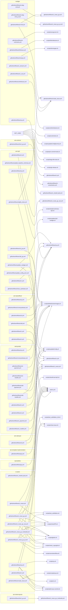

# CI-Action Usage Graph

This graph shows which repositories are using files from the ci-action repository.

```mermaid
graph LR
    F1[".github/workflows/ci-extrachecks.yml"]
    F2[".github/workflows/ci.yml"]
    F3[".github/workflows/ci_rebuild_bp3.yml"]
    F4[".github/workflows/ci_reuse.yml"]
    F5[".github/workflows/ci_reuse_go.yml"]
    F6[".github/workflows/ci_reuse_go_cas.yml"]
    F7[".github/workflows/ci_reuse_go_norebuild.yml"]
    F8[".github/workflows/ci_reuse_go_pr.yml"]
    F9[".github/workflows/cp.yml"]
    F10[".github/workflows/create_issue.yml"]
    F11[".github/workflows/rc.yml"]
    F12["action.yml"]
    F13["scripts/add-issue-commit.sh"]
    F14["scripts/cancelworkflow.sh"]
    F15["scripts/checkPR.sh"]
    F16["scripts/check_copyright.sh"]
    F17["scripts/close-issue.sh"]
    F18["scripts/cp.sh"]
    F19["scripts/createissue.sh"]
    F20["scripts/deleteDockerImages.sh"]
    F21["scripts/domergepr.sh"]
    F22["scripts/execgovuln.sh"]
    F23["scripts/gbash.sh"]
    F24["scripts/git-release.sh"]
    F25["scripts/large-file-hook.sh"]
    F26["scripts/linkmilestone.sh"]
    F27["scripts/pre-commit-hook.sh"]
    F28["scripts/rc.sh"]
    F29["scripts/rebuild-schemas-bp3.sh"]
    F30["scripts/rebuild-test-bp3.sh"]
    F31["scripts/test_subfolders.sh"]
    F32["scripts/test_subfolders_full.sh"]
    F33["scripts/unlinkmilestone.sh"]
    F34["scripts/update-bp3-voedger.sh"]
    F35["scripts/updateConfig.sh"]
    F36["scripts/updateConfigDummy.sh"]
    F37["scripts/vulncheck.sh"]
    subgraph SG1["voedger"]
        F38[".github/workflows/ci-full.yml"]
        F39[".github/workflows/ci-pkg-cmd.yml"]
        F40[".github/workflows/ci-pkg-cmd_pr.yml"]
        F41[".github/workflows/ci-vulncheck.yml"]
        F42[".github/workflows/ci_amazon.yml"]
        F43[".github/workflows/ci_cas.yml"]
        F44[".github/workflows/cp.yml"]
        F45[".github/workflows/linkIssue.yml"]
        F46[".github/workflows/merge.yml"]
        F47[".github/workflows/unlinkIssue.yml"]
    end
    subgraph SG2["airs-scheme"]
        F48[".github/workflows/short_go.yml"]
    end
    subgraph SG3["airs-bp3"]
        F49[".github/workflows/cd_go.yml"]
        F50[".github/workflows/cdd_go.yml"]
        F51[".github/workflows/ci.yml"]
        F52[".github/workflows/close_cprelease.yml"]
        F53[".github/workflows/cp.yml"]
        F54[".github/workflows/nightly_tests.yml"]
        F55[".github/workflows/rc.yml"]
        F56[".github/workflows/update_baseline_schemas.yml"]
        F57[".github/workflows/update_config_sync.yml"]
        F58[".github/workflows/update_voedger.yml"]
    end
    subgraph SG4["airs-template-implementation"]
        F59[".github/workflows/go.yml"]
    end
    subgraph SG5["dynobuffers"]
        F60[".github/workflows/go.yml"]
    end
    subgraph SG6["ci-action"]
        F61[".github/workflows/ci_rebuild_bp3.yml"]
        F62[".github/workflows/ci_reuse.yml"]
        F63[".github/workflows/ci_reuse_go.yml"]
        F64[".github/workflows/ci_reuse_go_cas.yml"]
        F65[".github/workflows/ci_reuse_go_norebuild.yml"]
        F66[".github/workflows/ci_reuse_go_pr.yml"]
        F67[".github/workflows/cp.yml"]
        F68[".github/workflows/create_issue.yml"]
        F69[".github/workflows/rc.yml"]
    end
    subgraph SG7["airc-backoffice2"]
        F70[".github/workflows/cd.yml"]
        F71[".github/workflows/cdd.yml"]
        F72[".github/workflows/ci.yml"]
        F73[".github/workflows/cp.yml"]
        F74[".github/workflows/cronecprelease.yml"]
        F75[".github/workflows/rc.yml"]
    end
    subgraph SG8["airc-ticket-layouts"]
        F76[".github/workflows/short_go.yml"]
    end
    subgraph SG9["web-portals"]
        F77[".github/workflows/cd-payment.yml"]
        F78[".github/workflows/cd-reseller.yml"]
        F79[".github/workflows/cdd-payment.yml"]
        F80[".github/workflows/cdd-reseller.yml"]
        F81[".github/workflows/ci.yml"]
        F82[".github/workflows/ci_payment.yml"]
        F83[".github/workflows/ci_reseller.yml"]
        F84[".github/workflows/cp.yml"]
        F85[".github/workflows/cronecprelease.yml"]
        F86[".github/workflows/rc.yml"]
    end
    subgraph SG10["airc-web-pos"]
        F87[".github/workflows/cd.yml"]
    end
    F88["NOT_USED"]
    F88 --> F1
    F88["NOT_USED"]
    F88 --> F2
    F48 --> F3
    F72 --> F4
    F81 --> F4
    F82 --> F4
    F83 --> F4
    F38 --> F5
    F39 --> F5
    F51 --> F6
    F76 --> F7
    F40 --> F8
    F53 --> F9
    F73 --> F9
    F74 --> F9
    F84 --> F9
    F85 --> F9
    F44 --> F9
    F54 --> F10
    F38 --> F10
    F42 --> F10
    F43 --> F10
    F55 --> F11
    F75 --> F11
    F86 --> F11
    F59 --> F12
    F60 --> F12
    F62 --> F12
    F63 --> F12
    F64 --> F12
    F65 --> F12
    F66 --> F12
    F54 --> F12
    F58 --> F12
    F67 --> F13
    F67 --> F13
    F69 --> F13
    F69 --> F13
    F66 --> F14
    F62 --> F15
    F63 --> F15
    F64 --> F15
    F65 --> F15
    F66 --> F15
    F63 --> F16
    F64 --> F16
    F65 --> F16
    F66 --> F16
    F67 --> F17
    F69 --> F17
    F52 --> F17
    F67 --> F18
    F68 --> F19
    F49 --> F20
    F50 --> F20
    F70 --> F20
    F71 --> F20
    F77 --> F20
    F78 --> F20
    F79 --> F20
    F80 --> F20
    F87 --> F20
    F46 --> F21
    F41 --> F22
    F63 --> F23
    F64 --> F23
    F65 --> F23
    F66 --> F23
    F88["NOT_USED"]
    F88 --> F24
    F88["NOT_USED"]
    F88 --> F25
    F45 --> F26
    F88["NOT_USED"]
    F88 --> F27
    F69 --> F28
    F56 --> F29
    F61 --> F30
    F63 --> F31
    F66 --> F31
    F63 --> F32
    F47 --> F33
    F58 --> F34
    F57 --> F35
    F71 --> F35
    F79 --> F35
    F80 --> F35
    F87 --> F35
    F88["NOT_USED"]
    F88 --> F36
    F88["NOT_USED"]
    F88 --> F37
```
